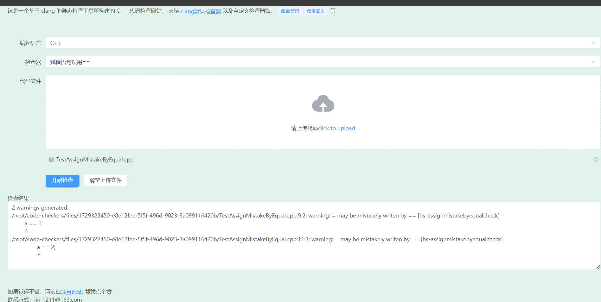

# 介绍
这是一个基于clang的静态检查工具所构建的 C++ 代码检查网站

### 功能演示
演示地址: http://60.204.224.115

项目截图:


### 部署

##### 下载源码
```
git clone https://gitee.com/liji1211/code-checkers.git
cd code-checkers
```
##### 编译web(这里通过docker来编译，也可以安装node再编译)
```
docker run -d -v ./frontend:/mnt node:20-alpine sh -c "cd /mnt && npm install --registry=https://registry.npmmirror.com && npm run build"
```
##### 创建python虚拟环境&&下载包
```
python3 -m venv ./venv
. venv/bin/activate
pip install -r backend/requirements.txt 
```
##### clang-tidy插件环境准备
请参考[clang-tidy-plugin](./clang-tidy-plugin/README.md)

##### 启动服务
```
nohup python3 run.py &
```
##### 结束服务
```
kill -9 `ps -aux | grep "python3 run.py"  | grep -v grep  | awk '{print $2}'`
```

### 开发
